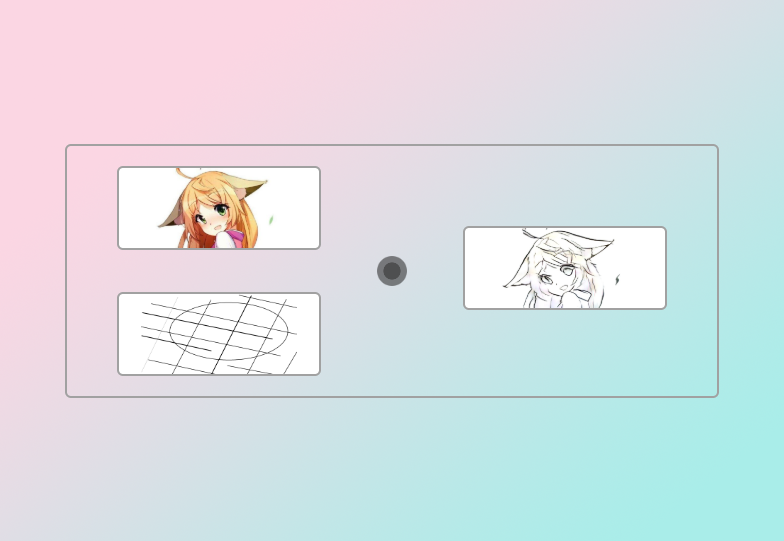

# Stylepro Artistic Demo
An Electron client demo for Paddle Hub Serving.



## Launch🚀

First ensure that you've installed [Paddle Hub](https://github.com/PaddlePaddle/PaddleHub) correctly, then run following commands to download and deploy the model. The web service would listen on port 8866 by default.

```
$ hub install stylepro_artistic
$ hub serving start -m stylepro_artistic
```

Then, in this repo, simply do things like other Node.js project.

```
$ npm install
$ npm start
```

